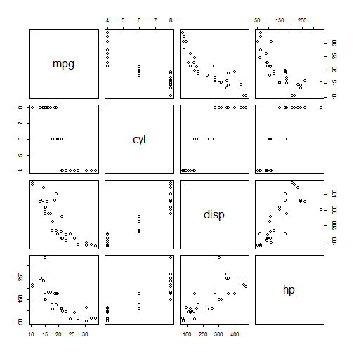

show_pairs
========================================================
author: BertrandJP
date: 26/04/2015

Context
========================================================

This presentation was made for the Johns Hopkins course on developping data products.

More information can be found on https://class.coursera.org/devdataprod-013


My project
========================================================

That presentation is only a documentation that contains a reduced version of the original application which included interactivity.

The original shinyapps that  be foud on https://bertrandjp.shinyapps.io/show_pairs/

The details of the code can be found on https://github.com/BertrandJP/JH9_show_pairs

Details of the application
========================================================

The application is able to:
1. Load a dataset from a local file. Note that this must be a csv file using ";" as field separator
2. Choose two or more columns from that dataset
3. Display the correlation graph (using function pairs) for these columns

If the user doesn't choose a local file, the application works with the "mtcars" dataset that is included in R

In this documentation, we will provide an exemple with the dataset "mtcars", and the first 4 columns.


Result
========================================================
data(mtcars)


```r
data(mtcars); myDataFunc = mtcars; myData = myDataFunc
ColsID = c('mpg', 'cyl', 'disp', 'hp')
pairs(myData[ColsID])
```

 
